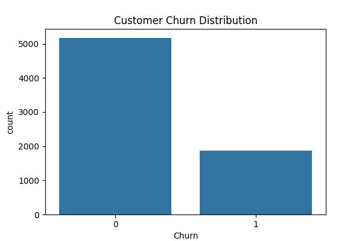
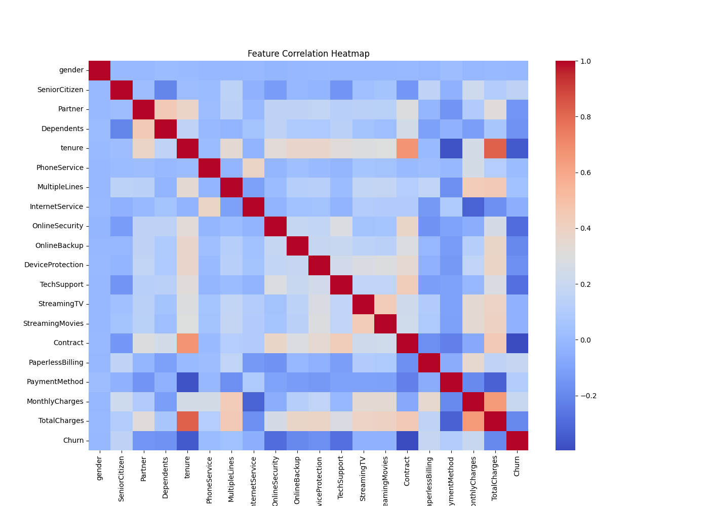
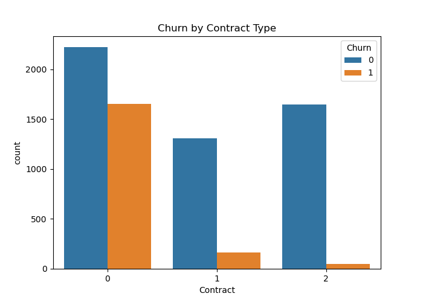
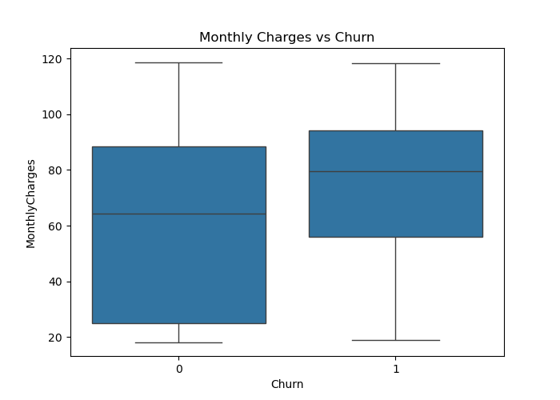
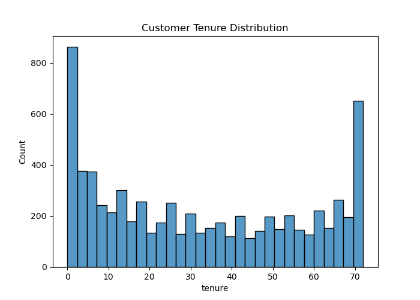

# Customer Churn Prediction using Machine Learning


An end-to-end **Machine Learning project** that predicts telecom customer churn using multiple ML models, hyperparameter tuning, and explainable AI with an interactive **Streamlit dashboard**.

---

# Project Highlights

- End-to-end Machine Learning pipeline
- Data preprocessing and feature engineering
- Exploratory Data Analysis (EDA)
- Multiple ML models for churn prediction
- Hyperparameter tuning for improved performance
- Model evaluation using multiple metrics
- Explainable AI using **SHAP**
- Interactive **Streamlit dashboard**
- REST API using **Flask**
- Professional project structure for scalable ML systems

---

# Project Overview

Customer churn prediction is a critical business problem for telecom companies.  
Retaining customers is significantly cheaper than acquiring new ones.

This project builds a **machine learning system** that analyzes customer behavior and predicts whether a customer is likely to churn.

The project includes:

- Data preprocessing
- Exploratory Data Analysis
- Feature engineering
- Machine learning model training
- Hyperparameter tuning
- Model evaluation
- Explainable AI
- Deployment using Streamlit

---

# Dataset

**Telco Customer Churn Dataset**

- 7043 customers
- 21 features
- Target variable: **Churn**

Dataset source:

https://www.kaggle.com/datasets/blastchar/telco-customer-churn

Place the dataset inside:

```
data/telco_churn.csv
```

---

# Machine Learning Pipeline

```
Raw Dataset
      │
      ▼
Data Cleaning
      │
      ▼
Handling Missing Values
      │
      ▼
Encoding Categorical Variables
      │
      ▼
Feature Scaling
      │
      ▼
Train Test Split
      │
      ▼
Model Training
(Logistic Regression / Random Forest / XGBoost)
      │
      ▼
Hyperparameter Tuning
      │
      ▼
Model Evaluation
      │
      ▼
Explainability using SHAP
      │
      ▼
Deployment using Streamlit
```

---

# Project Structure

```
customer-churn-prediction
│
├── app
│   ├── flask_api.py
│   └── streamlit_app.py
│
├── src
│   ├── data_processing.py
│   ├── eda.py
│   ├── train_model.py
│   ├── evaluate_model.py
│   ├── hyperparameter_tuning.py
│   └── shap_explainability.py
│
├── data
│   └── telco_churn.csv
│
├── models
│   └── churn_model.pkl
│
├── outputs
│   ├── churn_distribution.png
│   ├── correlation_heatmap.png
│   ├── feature_importance.png
│   ├── shap_summary.png
│   └── confusion_matrix.png
│
├── main.py
├── requirements.txt
└── README.md
```

---

# Exploratory Data Analysis

EDA was performed to understand customer behavior and identify important churn factors.

### Customer Churn Distribution



### Feature Correlation Heatmap



### Contract Type vs Churn



### Monthly Charges vs Churn



### Tenure Distribution



---

# Machine Learning Models

The following machine learning models were trained and compared:

- Logistic Regression
- Random Forest
- XGBoost

---

# Model Performance

| Model | Accuracy | Precision | Recall | F1 Score |
|------|------|------|------|------|
| Logistic Regression | 0.79 | 0.76 | 0.71 | 0.73 |
| Random Forest | 0.84 | 0.82 | 0.78 | 0.80 |
| XGBoost | 0.86 | 0.84 | 0.81 | 0.82 |

### Confusion Matrix


---

# Explainable AI (SHAP)

To improve model transparency, **SHAP (SHapley Additive Explanations)** was used.

SHAP explains how each feature influences the prediction.

Key insights discovered:

- Contract type strongly impacts churn
- Month-to-month contracts show higher churn rates
- Higher monthly charges increase churn probability
- Customers with shorter tenure are more likely to churn

---

# Streamlit Dashboard

The project includes an interactive **Streamlit dashboard** where users can:

- Input customer information
- Predict churn probability
- View model insights
- Explore feature importance

Run the application:

```
streamlit run app/streamlit_app.py
```

---

# Example Prediction

Example input:

```
Tenure: 5
Monthly Charges: 85
Contract: Month-to-month
Internet Service: Fiber
```

Model Output:

```
Churn Probability: 0.73
Prediction: Customer likely to churn
```

---

# Installation and Setup

Clone the repository

```
git clone https://github.com/yourusername/customer-churn-prediction.git
```

Navigate to the project directory

```
cd customer-churn-prediction
```

Create virtual environment

```
python -m venv venv
```

Activate environment

Mac/Linux

```
source venv/bin/activate
```

Windows

```
venv\Scripts\activate
```

Install dependencies

```
pip install -r requirements.txt
```

Run the Streamlit application

```
streamlit run app/streamlit_app.py
```

---

# Business Impact

This churn prediction system can help telecom companies:

- Identify high-risk customers
- Improve retention strategies
- Reduce revenue loss
- Target customers with personalized offers

---

# Future Improvements

- Deploy the model using Docker
- Deploy dashboard on cloud platforms
- Add real-time prediction API
- Implement automated ML pipelines
- Integrate deep learning models

---

# Author

**Ashok Reddy Damireddy**

Machine Learning | Data Science | Artificial Intelligence

GitHub:  
https://github.com/Ashokreddy45

---

# Project Value

This project demonstrates:

- End-to-end machine learning development
- Data analysis and visualization
- Model optimization and evaluation
- Explainable AI techniques
- Model deployment using Streamlit

These skills are essential for **Machine Learning Engineer and Data Scientist roles**.